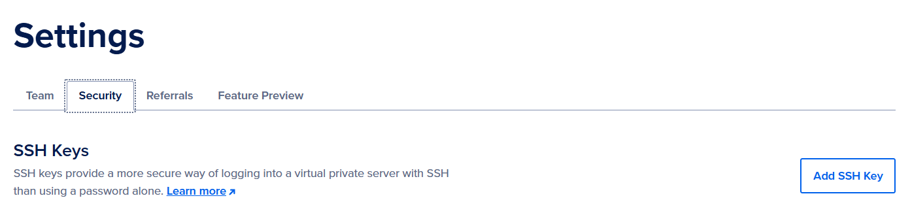
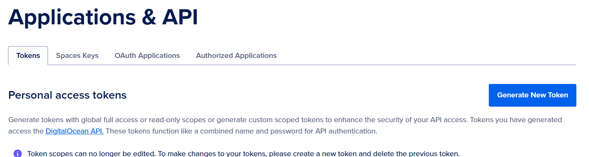

# Segundo Parcial – Infraestructura para TI

## Objetivo

Desarrollar una solución para automatizar el aprovisionamiento y configuración de la infraestructura necesaria para el despliegue de un proyecto que usa una API Web en Node.js la cual interactúa con una base de datos MySQL, utilizando DigitalO cean.

## Descripción del Proyecto

El proyecto consiste en desplegar una API Web en Node.js que utiliza Express y MySQL. Tanto la aplicación como la base de datos se desplegarán en un droplet de digitalocean.

**Recursos:**
- [Build Node.js Rest APIs with Express & MySQL - BezKoder](https://www.bezkoder.com/node-js-express-mysql-crud/)
- [Código completo en GitHub: bezkoder/nodejs-express-mysql](https://github.com/bezkoder/nodejs-express-mysql)


## Pasos Realizados

### 1. Preparar claves necesarias

Para comenzar, se generaronn las claves necesarias para autenticar el acceso a la API de DigitalOcean. Esto incluye una clave pública y una clave privada, así como un token de acceso.

1. Generación de claves SSH:
   - En la termina se puede ejecutar el siguiente comando para generar un par de claves SSH:
     ```bash
     ssh-keygen
     ```
   - Esto generará dos archivos: `id_rsa` (clave privada) e `id_rsa.pub` (clave pública), esta última será la que se agrege en add SSH key

   

2. Token de acceso:
   - Se necesitará para autenticarse con los scripts de Terraform.

   

3. Configuración de Terraform:
   - En el archivo `main.tf`, se define el token de acceso como una variable:
     ```hcl
     variable "digitalocean" {}

     provider "digitalocean" {
       token = var.digitalocean
     }
     ```

### 2. Creación de los dos droplets a través de terraform 

Definir los recursos en `main.tf`:
   - Se definirán dos recursos de tipo `digitalocean_droplet` en el archivo `main.tf`. Un droplet servirá para la API y otro para la base de datos.


